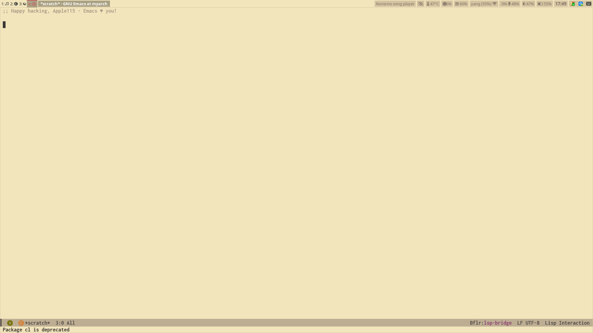

# apple115's dotfiles

## 图片



## 基本信息
                   -`                    apple115@myarch
                  .o+`                   ---------------
                 `ooo/                   OS: Arch Linux x86_64
                `+oooo:                  Host: ROG Strix G513QM_G513QM 1.0
               `+oooooo:                 Kernel: 6.6.44-3-lts
               -+oooooo+:                Uptime: 1 day, 5 hours, 17 mins
             `/:-:++oooo+:               Packages: 1582 (pacman)
            `/++++/+++++++:              Shell: zsh 5.9
           `/++++++++++++++:             Resolution: 1920x1080
          `/+++ooooooooooooo/`           WM: sway
         ./ooosssso++osssssso+`          Theme: Adwaita [GTK2/3]
        .oossssso-````/ossssss+`         Icons: Adwaita [GTK2/3]
       -osssssso.      :ssssssso.        Terminal: emacs
      :osssssss/        osssso+++.       CPU: AMD Ryzen 9 5900HX with Radeon Graphics (16) @ 4.890GHz
     /ossssssss/        +ssssooo/-       GPU: NVIDIA GeForce RTX 3060 Mobile / Max-Q
   `/ossssso+/:-        -:/+osssso+-     GPU: AMD ATI Radeon Vega Series / Radeon Vega Mobile Series
  `+sso+:-`                 `.-/+oso:    GPU Driver: NVIDIA 555.58.02
 `++:.                           `-/+/   Memory: 9197MiB / 15409MiB


- zsh配置:zim
- bar:waybar
- wm:sway
- terminal:kitty emacs-vterm
